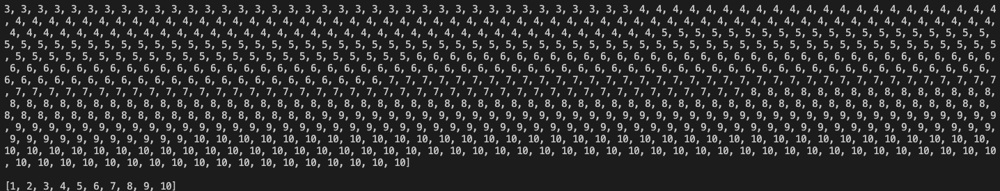

**1. 숫자끼리 비교하는 연산과 문자끼리 비교하는 연산 중 왜 문자끼리 비교하는 연산이 상대적으로 불리한지 이유에 대해서 정리해보고 샘플 코드를 구현해서 제출하기**
**숫자비교**
- 숫자 비교는 단순히 값만 비교하면 되므로 간단하고 빠르다.
- 숫자는 보통 기본 데이터 타입으로 처리되며, CPU 캐시에 잘 맞아들어가므로 더 빠른 처리가 가능하다.

**문자비교**
- 문자열은 비교할 때 ASCII 코드나 유니코드와 같은 문자 인코딩 순서로 비교한다.
- 문자열은 문자의 순서와 각 문자의 ASCII 코드, 유니코드를 비교해야 하므로 숫자보다 비교가 복잡하다.

```py
import random

numbers = random.sample(range(1, 11), 10)
strings = ['AAA', 'AAB', 'ABA', 'ABB', 'BAA', 'BAB', 'BBA', 'BBB']
random.shuffle(strings)

print(numbers)
print(sorted(numbers))
print(strings)
print(sorted(strings))

# 출력 결과
# [9, 2, 4, 1, 7, 8, 3, 10, 5, 6]
# [1, 2, 3, 4, 5, 6, 7, 8, 9, 10]
# ['BBA', 'ABA', 'BAB', 'AAB', 'BBB', 'AAA', 'BAA', 'ABB']
# ['AAA', 'AAB', 'ABA', 'ABB', 'BAA', 'BAB', 'BBA', 'BBB']
```
- 이렇게 문자열은 자리 마다 비교를 해야하므로 숫자보다 비교가 복잡하다.

**2. 파이썬으로 일부 중복되는 element를 저장하고 최소 element가 10개이상 되는 배열을 만든다. 그리고 set() 구문 없이 오로지 for in 문으로 배열의 중복된 값을 없애는 코드를 작성하기**
```py
import random

numbers = [random.randint(1, 10) for i in range(1000)]

print(sorted(numbers)) # 1, 1, 1, ... , 10, 10, 10

for i in numbers:
  while numbers.count(i) > 1:
    numbers.remove(i)

print(sorted(numbers)) # 1, 2, 3, ... , 8, 9, 10
```

