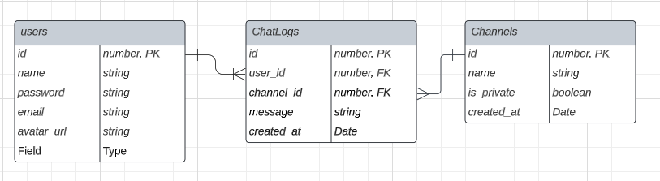

## 230802 과제

**dbeaver 또는 DBMS 툴로 내 웹사이트의 ERD를 그려서 스크린샷 찍어서 제출하기**

**요구사항**
- 내 웹사이트 전반적인 내용을 entity와 relation을 우선 고려하기
- relation이 구상되면 디비버와 같은 툴로 테이블과 컬럼 그리고 PK,FK를 구성하여 테이블을 생성하기
- 엔티티 관계도에 들어가서 구성된 테이블들을 스크린샷찍어서 제출하기
- 각 테이블과 컬럼은 영문을 이용해서 테이블을 만들 것 (해당 테이블과 컬럼에 대한 정보는 한글로 적어서 별도의 텍스트 파일로 작성하여 설명할 것)

- users: 회원 정보를 담고 있는 테이블
  - id: 회원 고유번호
  - name: 회원 이름
  - password: 회원 비밀번호
  - email: 회원 이메일
  - avatar_url: 회원 프로필 사진 주소
  - created_at: 회원 가입일
- channels: 채널 정보를 담고 있는 테이블
  - id: 채널 고유번호
  - name: 채널 이름
  - is_private: 채널 공개 여부
  - created_at: 채널 생성일
- chatLogs: 채팅 내역을 담고 있는 테이블
  - id: 채팅 고유번호
  - user_id: 채팅을 보낸 회원 고유번호
  - channel_id: 채팅이 전송된 채널 고유번호
  - message: 채팅 내용
  - created_at: 채팅 전송일

- users와 channels 테이블은 N:M 관계이다.
- chatLogs는 users와 channels 테이블을 참조하는 매핑 테이블이다.